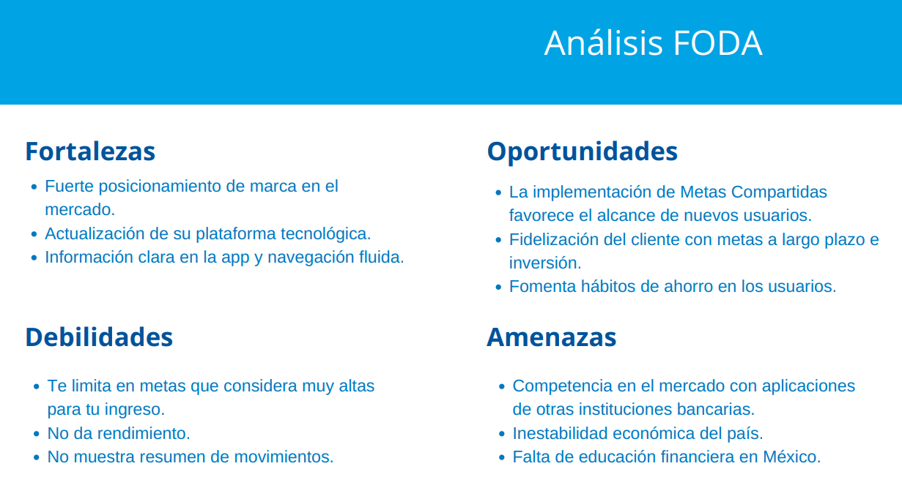

# Metas compartidas BBVA Bancomer

* **Track:** UX Specialization
* **Sprint 06:** UX PROCESS

## Objetivo:
 Implementar metas compartidas a la app móvil de BBVA Plan y su optimizació a partir de un sistema de diseño más unificado y amigable.

 ## Equipo
**Adriana Dillarza** UX Designer

**Ana Tamayo** UX Research

**Anett Trujillo** UX Research

**Carmen Vega** PO

**Elzbeth Blanco** UX Designer

**Jazmin López** UX Researcher

**Jessyca Cuevas** UX Desinger

**Jocelyn Esquivel** UX Research

**Karina Quezada** UX Researcher

**Tania Sosa** UX Designer

## Empatizar

### FODA
Realizamos un análisis FODA para determinar los factores críticos positivos de la aplicación, así como los factores críticos negativos que se deben eliminar o reducir y la amenaza que representan otras aplicaciones de ahorro en el mercado para BBVA Plan. Con el objetivo de tomar decisiones estratégicas para mejorar las situación actual.

### PESTEL
Con el análisis de PESTEL definimos el contexto de el producto BBVA Plan. Partiendo de el estudio de factores externos políticos, económicos, sociales, tecnológicos, ambientales y jurídicos que pueden influir en su alcance.

### Objetivos SMART
* Aumentar el número de descargas de la app BBVA Plan en un 35% y la calificación de la misma de 3.6/5 a 4/5 en un plazo de 6 meses a través de la optimización con nuevas funciones y la implementación de metas compartidas.

* Incrementar el porcentaje de ventas de la cartera de productos financieros en un 5%  en un periodo de 6 meses por medio de la implementación de “Smarcasts” que sean afines a los hábitos de ahorro de los usuarios, brindándoles soluciones específicas a sus necesidades.  

* Fomentar la educación financiera de nuestros usuarios, generando así una fidelización a nuestra marca en un plazo de un año, aumentando en un 3% el número de clientes que realizan inversiones, más allá del ahorro con rendimientos.

* Aumentar de 5.3 a 6.5 millones el número de clientes digitales y de 21.7% a 32% el porcentaje de ventas digitales durante 2018 afianzando la confianza del consumidor y asesorando a los usuarios en el momento en que lo necesitan.

### Mapa de empatía
El mapa de empatía nos permitió conocer quién es el cliente, qué problema tiene y qué propuesta de valor le vamos a ofrecer.

### User persona
Para definir a nuestro user persona, realizamos una primera encuesta, con la cual pudimos perfilar al usuario de la aplicación.  [Encuesta 1. Perfil de usuario y hábitos de ahorro](https://docs.google.com/forms/d/1JZ4vUEQPfACjVFVtUy3TG4yQjZq19DVZchVp3yDnCuI/edit#responses)

### Costumer Journey Map
Una vez definido el user persona se realizó un journey map que nos permitió identificar el área de mayor riesgo para que el usuario abandonara su tarea y en este caso pudimos concluir que eran: no poder generar su token, no está especificado en las tiendas de descarga que no es apta para todos los cuenta-habientes.

### Propuesta

#### Segunda encuesta

[Encuesta 2.Validación de metas compartidas.](https://docs.google.com/forms/d/1xQG95FrmXMX3TUF0MLQWHzL8O1LkLA4n0I9GTi24H5I/edit?usp=drive_web)
