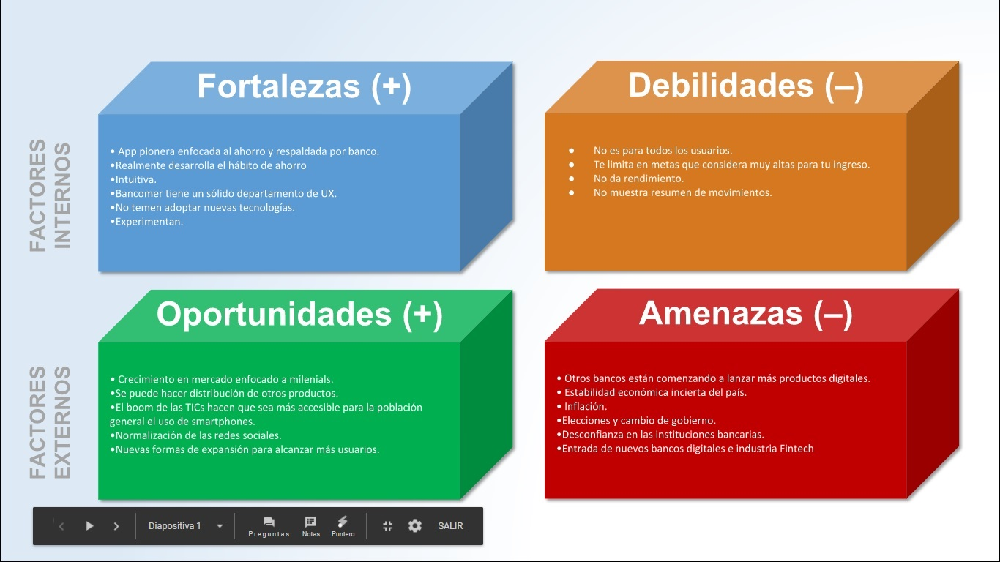
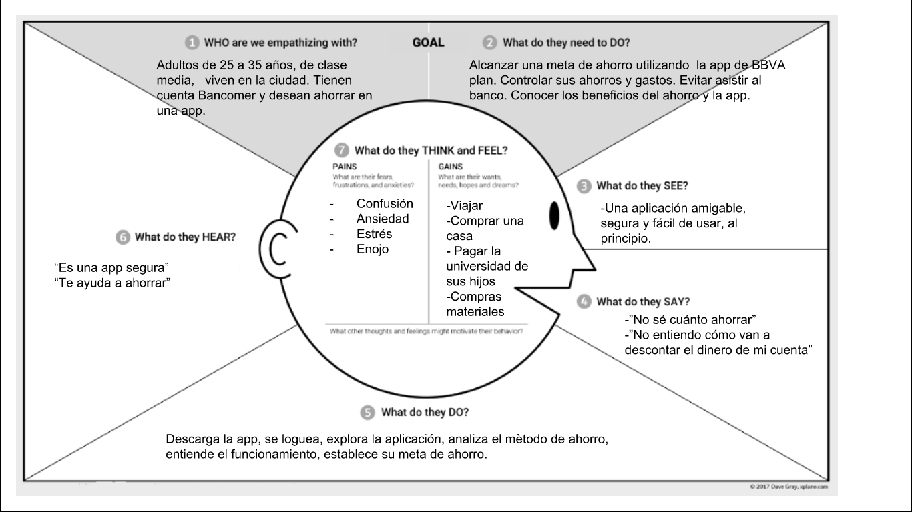
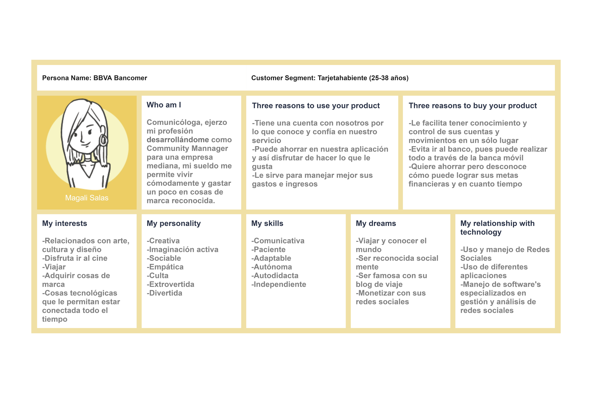
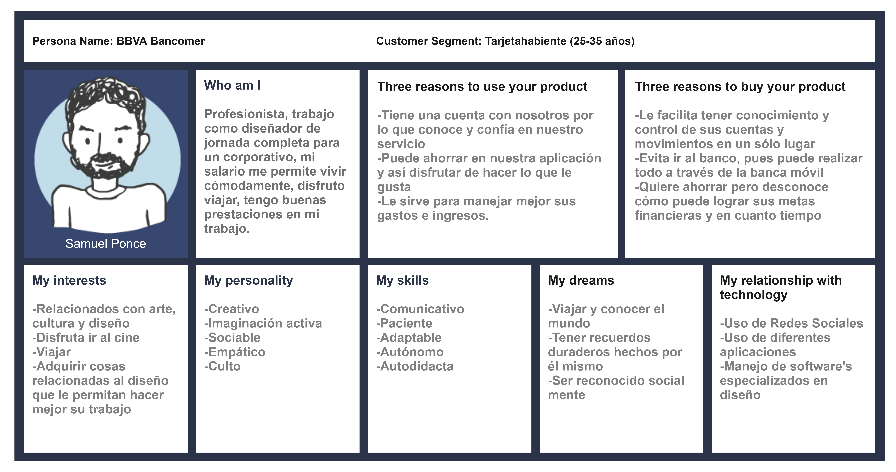
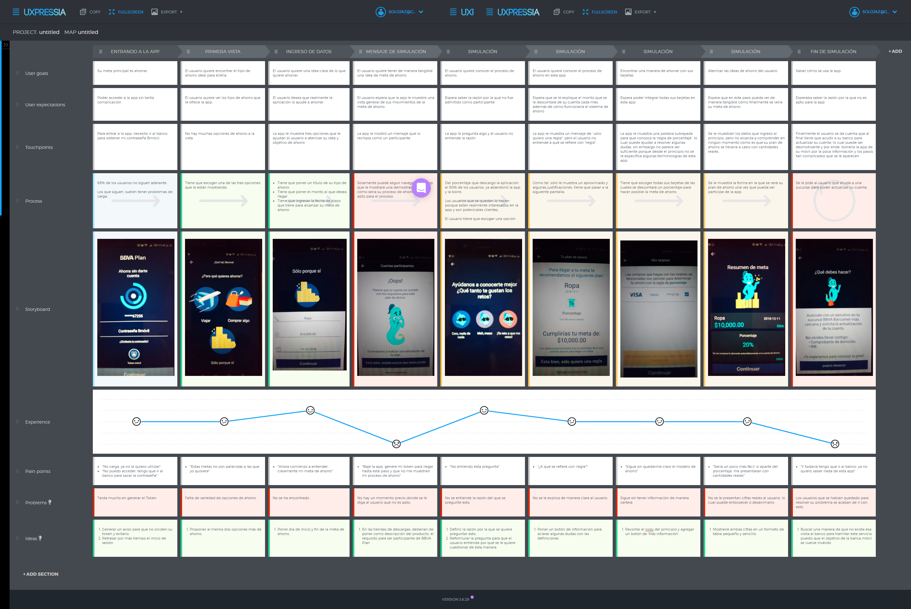

# Metas compartidas BBVA Bancomer

* **Track:** UX Specialization
* **Sprint 06:** UX PROCESS

## Objetivo:
 Implementar metas compartidas a la app móvil de BBVA Plan y su optimizació a partir de un sistema de diseño más unificado y amigable.

 ## Equipo
**Adriana Dillarza** UX Designer

**Ana Tamayo** UX Research

**Anett Trujillo** UX Research

**Carmen Vega** PO

**Elzbeth Blanco** UX Designer

**Jazmin López** UX Researcher

**Jessyca Cuevas** UX Desinger

**Jocelyn Esquivel** UX Research

**Karina Quezada** UX Researcher

**Tania Sosa** UX Designer

## Empatizar

### FODA
Realizamos un análisis FODA para determinar los factores críticos positivos de la aplicación, así como los factores críticos negativos que se deben eliminar o reducir y la amenaza que representan otras aplicaciones de ahorro en el mercado para BBVA Plan. Con el objetivo de tomar decisiones estratégicas para mejorar las situación actual.

### PESTEL
Con el análisis de PESTEL definimos el contexto de el producto BBVA Plan. Partiendo de el estudio de factores externos políticos, económicos, sociales, tecnológicos, ambientales y jurídicos que pueden influir en su alcance.

### Mapa de empatía
El mapa de empatía nos permitió conocer quién es el cliente, qué problema tiene y qué propuesta de valor le vamos a ofrecer.

### User persona
Para definir a nuestro user persona, realizamos una primera encuesta, con la cual pudimos perfilar al usuario de la aplicación.  [Encuesta 1](https://docs.google.com/forms/d/1JZ4vUEQPfACjVFVtUy3TG4yQjZq19DVZchVp3yDnCuI/edit#responses)

### Costumer Journey Map
Una vez definido el user persona se realizó un journey map que nos permitió identificar el área de mayor riesgo para que el usuario abandonara su tarea y en este caso pudimos concluir que era en

